# Sync & continuity — implementation plan

Companion to `sync.html` (UX contract, S1–S10) and the 2026-07-19 decisions in
`design-notes.md`. Scope: **P8 layers 1 + 2** — Handoff continue (S2–S6) and
enrollment / first-open bootstrap / ledger (S1, S7, S8). Layer 3 (iCloud) stays
design-ahead: nothing here may preclude it, nothing here builds it.

Branch: dedicated follow-up branch off `main` after the iPhone port merges
(per design-notes: not on `feat/iphone_port`).

---

## 1 · What already exists (build on, don't rebuild)

| Mock reference | Real code | State |
|---|---|---|
| geometry-neutral attach (`ignore-size`) | `TmuxController` (phone-client sizing rules), `AutoTmuxScript.preserveExistingGeometry`, `MoshSession.preserveTmuxGeometry`, `MoshBootstrap` | done on the iPhone-port branch |
| idempotent key install | `Keys/RemoteAuthorizedKeysInstaller.swift` | done — reuse as-is |
| installation ledger | `KeySecurityMetadataStore.remoteInstallations` (`RemoteInstallation` Codable records in `StoredKey.swift`) | exists — needs grantor/direction fields |
| host-key pins + fingerprints | `KnownHostsStore` (`base64(SHA256(wire blob))` — same format as the descriptor's `hostKeyFP`) | exists — needs match-against-peer input |
| trust card | `HostKeyVerificationView` | exists — gains match/mismatch line |
| lock stash & replay | `ContentView` `isLocked` guard + `AppLockController` | pattern exists — continuation becomes one more stashed input |
| key generation | `KeyStore.generateEd25519` / `generateP256` (Secure Enclave = **P-256 only**) | exists — see decision D1 |
| host model | `PersistedHost` (+ SwiftData migration constraints), `HostEntryView` | exists — editor gains prefill mode |

No `NSUserActivity` code exists yet — the continuity layer is greenfield.

---

## 2 · Architecture

Three new, deliberately small modules plus surgical extensions. One universal
app on two devices; every flow is direction-agnostic by construction (the same
code runs on both ends, roles decided at runtime).

```
Tessera/Continuity/            ← layer 1 (Handoff)
  SessionActivityDescriptor.swift   pure Codable value, versioned, allowlist fields
  ActivityBroadcaster.swift         NSUserActivity lifecycle (focus → becomeCurrent,
                                    lock/disconnect/background → invalidate)
  ContinuationResolver.swift        pure func: descriptor → .fastPath(host)
                                    | .endpointMatch(host) | .prefill(descriptor)
  ContinuationCoordinator.swift     stash/replay behind app lock, drives UI
  ContinuationOverlayView.swift     S2/S3 progress overlay
  CredentialCardView.swift          S6 (password | "authorize from other device")

Tessera/Enrollment/            ← layer 2a (over Handoff continuation streams)
  EnrollmentMessages.swift          versioned framed messages — public-key types only
  EnrollmentService.swift           request/approve state machines (both roles)
  EnrollmentApprovalView.swift      S7/R4 Face ID approval card

Tessera/Bootstrap/             ← layer 2b (own transport, independent of Handoff)
  NearbyHandshake.swift             X25519 + HKDF + SAS derivation — pure, no I/O
  NearbyTransferService.swift       NWBrowser/NWListener (Bonjour) + encrypted channel
  BootstrapManifest.swift           allowlist Codable: hosts, jump chains, settings
  BootstrapCoordinator.swift        welcome-screen flow, origin approval, receipt
  (views: welcome options, SAS screen, origin approval card, steps receipt)
```

Extended in place: `HostEntryView` (prefill), `KeysPageView` (device-access
section, S8), `SettingsPageView` (continuity group, S9), `HostKeyVerificationView`
(informed TOFU), `KnownHostsStore` (peer-match audit tag), `KeySecurityMetadataStore`
(grantor fields), `TesseraApp`/Info.plist (`NSUserActivityTypes`,
`NSLocalNetworkUsageDescription` + Bonjour service type).

Key structural choices:

- **The descriptor and the manifest are the only things that cross devices in
  layer 1/2b, and both are typed allowlists.** No dictionaries, no "extra"
  payload field. Adding a field means touching the one Codable struct and its
  classification test (§3).
- **Resolver and handshake are pure.** `ContinuationResolver` and
  `NearbyHandshake` take values, return values, and are fully unit-testable
  without a device, a peer, or a network.
- **One grant engine.** S1's per-host checklist, S6's accent button, and S7's
  approval card all funnel into `EnrollmentService` →
  `RemoteAuthorizedKeysInstaller` → ledger. Bootstrap does not get its own
  install path.
- **Transports stay honest.** Continue vs reconnect is a pure function of
  `launchMode` (tmux modes → continue; plain ssh/mosh → reconnect). The
  descriptor carries the resolved tmux session name; attach reuses the existing
  `ignore-size` machinery. The one new tmux behavior is the reverse-attach cede
  rule (phone-born session: phone client flips itself to `ignore-size` when a
  larger client attaches) — lives in `TmuxController` where client-size logic
  already is.
- **SwiftData caution:** created-from-handoff hosts adopt the sender's UUID
  (data-only, no schema change). Any *new persisted field* goes on `Identity`
  or a sidecar store, never as a new `PersistedHost` column (iOS 26 `[String]`
  migration crash).

---

## 3 · Security architecture (the load-bearing part)

The S10 guarantees, translated into mechanisms:

**Secret-free by construction, enforced by test.**
`SessionActivityDescriptor` and `BootstrapManifest` are explicit field
allowlists. Add a reflection-based classification test: enumerate
`PersistedHost` / `Identity` / settings properties and assert every one is
explicitly classified `syncable` or `never-syncs` in a checked-in table —
a future field added without classification fails CI, so secrets can't leak
into sync by omission. Also keep the existing posture tests green
(`cloudKitDatabase: .none`, no `kSecAttrSynchronizable`).

**Private keys can't move because the APIs can't express it.**
`EnrollmentMessages` and `BootstrapManifest` accept public-key value types
(blob + fingerprint + metadata), never `StoredKey` or anything holding a
private handle. Secure Enclave keys are non-exportable anyway; this makes the
software-key path equally safe and makes misuse a compile error.

**Every grant is biometric, on the origin, with a ledger.**
There is no headless code path to `RemoteAuthorizedKeysInstaller` from any
sync feature: the only entry is `EnrollmentService.approve()`, which requires
a fresh LocalAuthentication success (existing `Security/` wrappers) and writes
a `RemoteInstallation` record on **both** sides (grantor + key owner; new
fields: peer device name, direction, flow origin: bootstrap/enrollment).
Revoke (S8) runs the installer in reverse from either side.

**Nearby bootstrap: mandatory order, SAS-bound.**
`discover → encrypted channel → SAS compare → Face ID → manifest`. Sketch:

- Ephemeral X25519 key agreement per transfer (CryptoKit), HKDF → session key,
  ChaChaPoly for the channel. No persistent pairing state, no stored peer keys.
- SAS = 6 decimal digits derived by HKDF over the full handshake transcript
  (both ephemeral publics + role labels, so reflection fails). Fresh keys →
  fresh code every run; a wrong code means abort, not retry-in-place. This is
  the Bluetooth numeric-comparison model: an active MITM gets one 10⁻⁶ guess
  and a visible failure.
- The manifest is sealed and sent only **after** the origin's Face ID approval,
  which displays the SAS. Manifest-before-code is forbidden because manifest
  integrity is trust-relevant: a poisoned manifest could pre-seed false
  `hostKeyFP` values (the informed-TOFU input).
- `NWListener` runs only while the welcome/bootstrap screen is foreground;
  torn down on background/cancel. Device names are display-only, never a trust
  input.

**Enrollment inherits Apple's peer binding — documented as load-bearing.**
S7 needs no SAS because `NSUserActivity` continuation streams only open
between devices on the same Apple Account. Encode this as a comment + a
one-line assertion in `EnrollmentService`: if enrollment ever moves to another
transport, it must adopt `NearbyHandshake` (SAS). Manual fallback stays
Apple-native (copy public key → Universal Clipboard / AirDrop → existing
`InstallKeyToHostFlow`).

**Lock always wins.** `ActivityBroadcaster.invalidate()` on lock;
`ContinuationCoordinator` stashes incoming continuations behind the existing
`isLocked` guard and replays on the unlock `onChange` — same pattern
`ContentView` already uses for external inputs. Continuation taps are user
actions, so never-auto-connect holds; there is no path that opens a
connection without a tap.

**Informed TOFU stays per-device.** The descriptor/manifest carry `hostKeyFP`
(fingerprint only — same `base64(SHA256(blob))` format `KnownHostsStore`
already computes). The trust card compares and renders match (green) /
mismatch (amber, safe action promoted, "trust anyway" demoted). The pin
created belongs to the local device; pins never transfer. `KnownHostsStore`
records gain an optional audit tag ("matched iPad at trust time").

Threat table (what each mechanism buys):

| Threat | Answer |
|---|---|
| LAN impostor posing as "Dev One's iPad" | SAS compare; names never trusted |
| Poisoned manifest pre-seeding false pins | manifest only after SAS + Face ID; `hostKeyFP` still ends in an explicit per-device confirm |
| Descriptor sniffed / replayed | secret-free; continuing still requires tap + local credentials |
| Stolen unlocked peer granting itself access | Face ID (user presence) on every grant; both-sided ledger + revoke |
| MITM on first connect from new device | informed TOFU mismatch state; mismatch demotes the unsafe action |

---

## 4 · Decisions to confirm before building (D1–D3)

- **D1 — default auto-created key type.** The mock says `id_ed25519 · secure
  enclave`, but the Secure Enclave only does P-256. Recommendation: auto-create
  **SE P-256** (`ecdsa-sha2-nistp256`) — the "private key never leaves the
  Secure Enclave" guarantee is load-bearing in S10 — and fix the mock copy.
  (Alternative: software ed25519, weaker guarantee, only wins on very old sshd.)
- **D2 — descriptor size budget.** Handoff userInfo should stay small (~3 KB
  practical). `via[]` chains of endpoint descriptors fit; assert size in the
  encoder test.
- **D3 — bootstrap settings payload.** "settings & appearance" = the
  `AppearancePreferences` / settings allowlist; enumerate exactly which keys in
  the classification table (some are device-idiom-specific and shouldn't move).

---

## 5 · Workstreams, order, and parallelism

```mermaid
flowchart LR
  A[A · descriptor + resolver + classification tests]
  B[B · broadcast + continue + lock stash + overlay]
  C[C · informed TOFU + prefilled editor + credential card]
  D[D · reverse-attach cede rule &#40;tmux&#41;]
  E[E · enrollment streams + grant engine + ledger/revoke UI]
  F[F · nearby bootstrap: handshake/SAS + transport + manifest + UI]
  G[G · settings group + polish]
  A --> B --> C --> E
  A --> F
  D --> B
  E -.grant engine reused.-> F
```



**Critical path:** A → B → C → E. Everything else hangs off it.

- **A — foundation (first, small).** `SessionActivityDescriptor`,
  `ContinuationResolver`, classification test, size test. Pure code, no UI.
  Unblocks every other track; do this solo before fanning out.
- **B — Handoff continue (critical path).** Broadcaster, coordinator + stash,
  overlay, honest labels, Info.plist. Both directions fall out of the same
  code; the only per-platform bits are the discovery surfaces (App Switcher /
  Dock), which are system-owned.
- **C — never-seen + credentials (critical path).** `HostEntryView` prefill,
  trust-card match/mismatch, S6 card (password path first; the accent button
  lands with E).
- **D — tmux cede rule (parallel with B/C).** Pure `TmuxControl` work +
  integration case. Disjoint files — good delegation candidate.
- **E — enrollment + ledger (after B plumbing exists).** Streams protocol,
  grant engine, Face ID gate, ledger fields + S8 UI, revoke. UI/ledger halves
  are parallelizable internally.
- **F — nearby bootstrap (fully parallel from day 1).** Depends only on A's
  classification pattern and, at the very end, E's grant engine for the
  per-host checklist. `NearbyHandshake` (pure crypto + SAS vectors) and
  `NearbyTransferService` + UI can be built and two-sim-tested while B/C/E
  proceed. Largest independent chunk — the natural second track for a
  parallel agent.
- **G — settings (anytime, trivial).** Filler work between milestones.

Practical split for two parallel lanes (per the delegation rules — disjoint
files, backend/mechanical to a sub-agent): **lane 1 (main): A → B → C → E**;
**lane 2 (delegate): F handshake/transport + D**, verified on the main thread.
Keep fan-out ≤ 2–3 concurrent.

### Milestones (each human-testable, per working rules)

1. **M1 — continue, fast path.** A + B + D: both directions, all four
   transports, honest labels, lock stash/replay, geometry neutrality.
2. **M2 — never-seen host.** C: prefilled editor, informed TOFU
   match/mismatch, credential card (password path).
3. **M3 — enrollment + ledger.** E: one-tap authorize both directions,
   device-access rows, revoke from either side.
4. **M4 — first-open bootstrap.** F: both directions, SAS, auto key (D1),
   per-host grant checklist, receipt.
5. **M5 — settings + regression gate.** G + full integration suite run
   (this feature is squarely in the "large-scale regression gate" class:
   multi-file, cross-transport, protocol edges) + adversarial review pass.

---

## 6 · Testing strategy

- **Simulator reality:** Handoff and continuation streams do **not** work in
  simulators. Add a `#if DEBUG` env-gated descriptor-injection hook
  (`TESSERA_CONTINUITY_HARNESS` pattern, like `TESSERA_FILES_HARNESS`) so
  resolve → overlay → TOFU → credential flows are fully drivable in the sim;
  real Handoff broadcast/receive is a user on-device step at each milestone.
  Design `EnrollmentService` against a transport protocol with a loopback
  implementation so both role state machines are testable in-process.
- **Nearby bootstrap** is testable between two temporary simulators on the
  same Mac (local network works) — never the user's booted sim; mind the
  two-sim gotchas from the jump-hosts round.
- **Unit:** resolver decision table; descriptor/manifest round-trip + size;
  classification test; SAS test vectors (fixed transcripts → digits, role
  reflection fails); ledger record migration (old records decode with
  defaults).
- **Integration suite additions:** continue/reconnect labels across all four
  transports; geometry non-mutation assert (`tmux display -p` window size
  before/after phone attach, and after cede + iPad detach); enrollment
  install → connect-with-own-key → revoke → key rejected, on the VPS
  fixtures; TOFU mismatch path (fixture host with rotated key).
- **Security posture:** existing no-sync keychain/CloudKit assertions stay;
  add asserts that broadcast invalidates on lock and that no grant path
  succeeds without a fresh auth context.

---

## 7 · Explicit non-goals (this branch)

- iCloud sync (layer 3): S1 restore row stays grayed, S9 frames 2–3 unbuilt.
  Separate proposal (CloudKit unique-constraint / migration work).
- In-app nearby-sessions list (no API; stance).
- Any change to iPad sizing behavior for iPad-born sessions.
- `window-size latest` / `aggressive-resize` — never.
